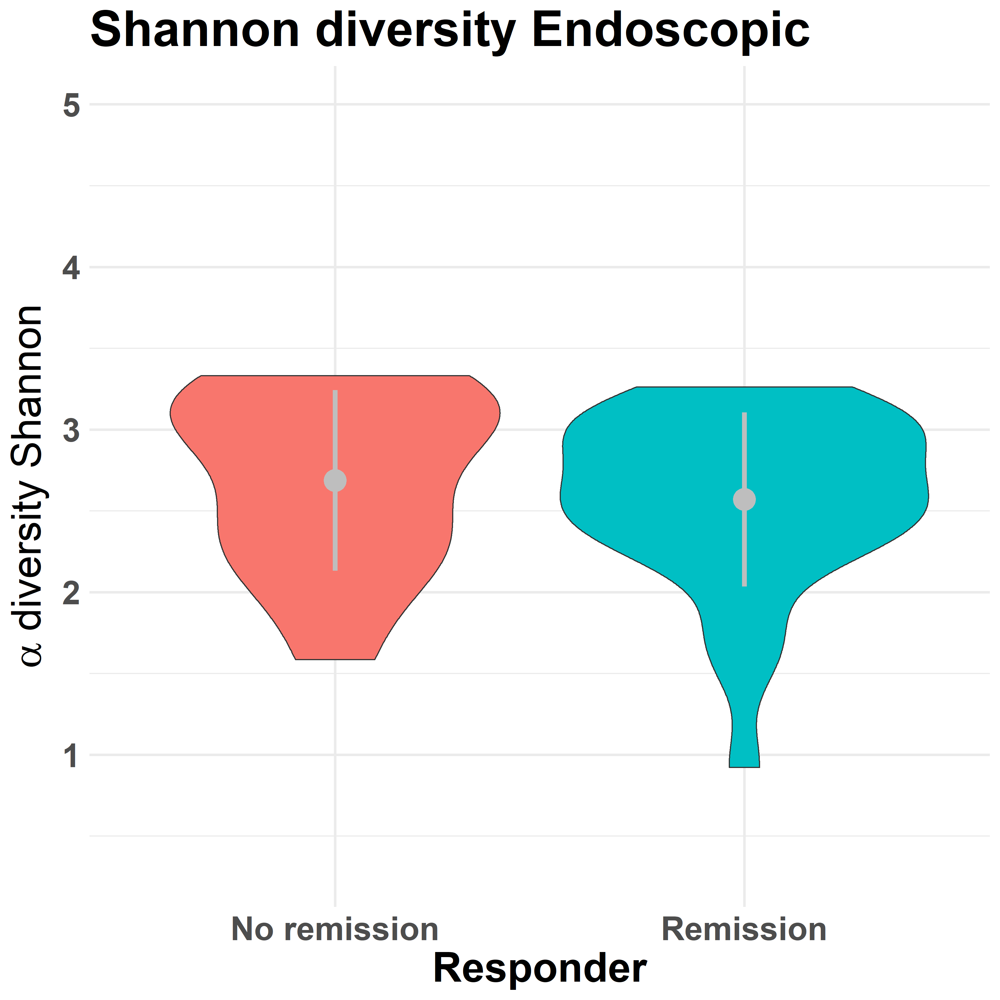

# Alpha Beta Diversity Code

The alpha-beta diversity code iterates on all combinations of week (0, 14, 24) - diagnosis/cohort (CD, UC) - treatment (VDZ, UST, TNF) and outcome (Endoscopic, the most relevant one, Biomarker, and Clinical) to get descriptive analysis, both quantitative and qualitative, on the Alpha and Beta diversity. For each cohort, it divides between responders and non-responders and calculates the different diversity measures.

## Input
- OTU table: The table containing the abundances of each taxa for each patient.
- The Metadata: i.e., `w=_n355_metadata.txt`, contains the information mapping the individuals to their external characteristics.

## Aim
- Identify for which combination of diagnosis, treatment, and week the alpha and beta diversity is different among responders and non-responders.

## Structure

- `CALLING_SCRIPT_Alpha_Beta.r` launches a for-loop that iterates over all combinations of week (0, 14, 24) - diagnosis/cohort (CD, UC) - treatment (VDZ, UST, TNF) and outcome. It calls `Cohort_based_Alpha_Beta_Diversity.r` for each iteration.
- `Cohort_based_Alpha_Beta_Diversity.r` divides between responders and non-responders and calculates the Alpha and Beta diversity for each of them. Then, for the Alpha diversity, it compares the distribution and extracts a p-value indicating how unlikely it is to have such a difference in Alpha diversity only due to chance.
- Related, code in the `Fractional_abundances_Pie_chart` folder computes pie charts for the abundances.

## Results
- The key results of the alpha-beta diversity pipeline are, for each iteration:
  1) Graphs about alpha and beta diversity among responders and non-responders.
  2) p-value between alpha diversity distributions.
- Graphs and results are saved in `Graphs/Alpha_beta_diversity`, with each combination of cohort + treatment + week named accordingly. I.e., for `CD_TNF_w0`, in the folder, there is the Beta and Alpha diversity for responders and non-responders for each of the three outcomes, together with the `.rds` file of the p-value from the Wilcoxon test for the Alpha diversity.

An example of the result is shown here, for the Alpha and Beta diversity of cohort CD, treatment TNF, week 0, and outcome Endoscopic.

### Alpha Diversity:

### Beta Diversity:
![image](../../images/Beta_
