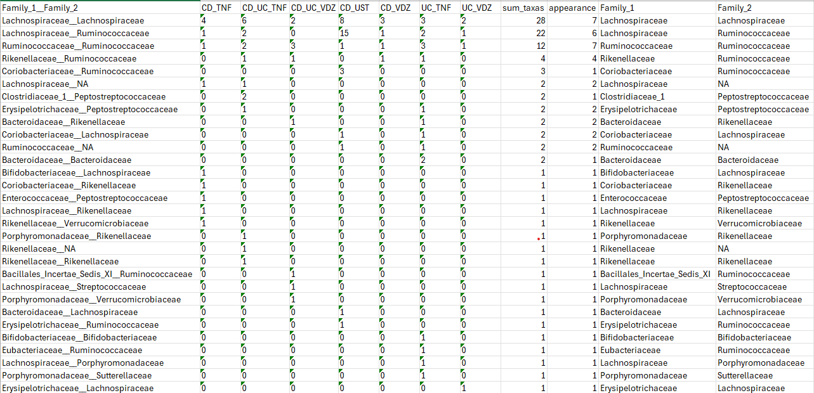

# Group Results Code

In this folder, the code to group together the LIMMA results, done on ISN edges, for multiple combinations of cohort + treatment + week is shown. The outcome utilized is the response to the treatment, in all three forms: Endoscopic (key one), Clinical, and Biomarker.

## Input
- LIMMA results for each combination.
- Taxonomic annotation: taxa → genus → family → …

## Aim
- Identify key taxa that have significantly different connections (i.e., edges) before/after the treatment, divided based on the trajectory of individuals' Enterotypes.

## Structure

- `CALLING_comprimer_v3.r` calls the comprimer code for both the nodes (by summing all the edges that are related to each node) and the edges.
- `comprimer_v3.r` and `comprimer_v3_interactions.r` create a table as shown in `Results/Limma/Edge-based/w_0/`, where, grouping taxa per Genus, Family (or Taxon level itself), we see how many of the hits (i.e., a hit is a pair of Taxon-Taxon that has an adjusted p-value < .05), deemed significant with LIMMA, are common in different cohort/treatment/outcome combinations.  
  In particular, `comprimer_v3.r` focuses on finding single taxa more present in the various cohort/treatment combinations, while `comprimer_v3_interactions.r` finds the hits, i.e., the pairs of taxa, that are shared among different combinations. Analogous analyses are also reported on LIMMA hits for different outcomes.

## Results
- The key result is a table where the key taxa (or pair of taxa) are highlighted for the LIMMA analysis.
  
An example of the result is shown here, for LIMMA with 0.25 as the threshold, at week 0 and for the endoscopic outcome. The taxa are aggregated at the family level.

