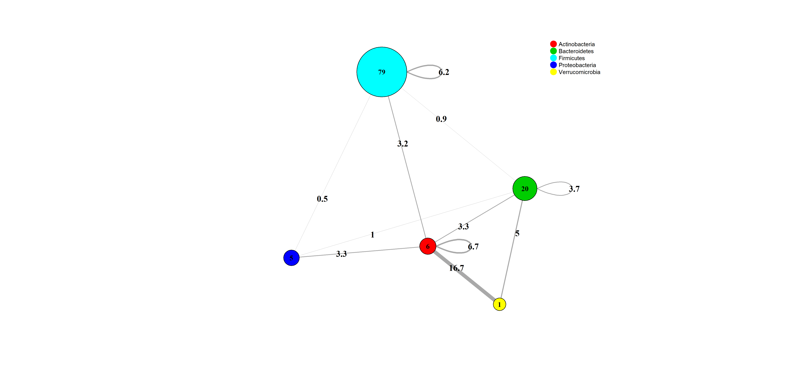

# Group Results Code

## ISN Construction and Network Analysis

This repository contains the code for constructing MAGMA population-based and Inferred Similarity Networks (ISN) for microbiome analysis. The ISN construction adjusts for covariates and excludes individuals who do not share sufficient ISN-edges with the rest of the population. The workflow also provides initial graphical representations of the calculated networks.

For each combination of **week** (0, 14, 24), **diagnosis/cohort** (CD, UC), **treatment** (VDZ, UST, TNF), the analysis produces a set of networks with graphical outputs.

---

## Input

### Required Data Files:
- **Taxonomic annotation**: Metadata detailing taxa → genus → family → (higher taxonomic levels).
- **OTU dataset**: The dataset with microbial taxa abundance for the selected iteration.
- **Metadata file (`w=_n355_metadata.txt`)**: Contains external characteristics for each individual, such as the outcome and covariate information.

---

## Aim

The goal of this analysis is to:
- **Compute the ISN** for each iteration (based on weeks, cohorts, and treatments).

---

## Structure of the Code

### Overview

The code is structured into several key components, which facilitate the construction of ISN networks and graphical analysis:

1. **Calling Script (`Calling_SCRIPT.r`)**: 
   - This driver script executes the **ISN_construction.R** workflow multiple times for each combination of week, cohort, and treatment.

2. **ISN Construction (`ISN_construction.R`)**:
   - **Data Import**: Imports OTU and metadata, with optional filtering based on the `active_disease_at_baseline` column. Prevalence (default: 0.25) and sequencing depth (default: 500) filters are applied.
   - **Covariate Preprocessing**: Handles missing values and converts categorical covariates (e.g., `Disease_location_baseline`) into dummy variables.
   - **Group Selection**: Filters data based on disease (e.g., CD, UC) and treatment (e.g., VDZ, UST, TNF) criteria.
   - **MAGMA Analysis**: Runs MAGMA analysis on the filtered dataset to generate population-based networks and store results. It excludes individuals with limited similarity to the rest of the population (default MAGMA setting).
   - **ISN Computation**: Computes the ISN for each individual based on the population-based network and leave-one-out (LOO) network.
   - **Graphical Outputs**: Generates and saves visualizations of the MAGMA networks, including both binary and continuous versions.

3. **ISN Functions**: These functions are utilized within the `ISN_construction.R` script:
   - **Mode**: Computes the mode (most frequent value) of a vector.
   - **data_importing**: Imports datasets, supporting different delimiters.
   - **importing_base_data_and_select_cropping**: Filters the OTU table by prevalence and sequencing depth, then selects relevant covariate data.
   - **selecting_only_group**: Filters the data for a specific diagnosis and treatment combination (e.g., CD treated with TNF).
   - **build_igraph_from_magma**: Constructs an undirected graph from MAGMA results using the `igraph` package.
   - **build_LOO_net**: Implements Leave-One-Out (LOO) cross-validation for network construction and saves the results.
   - **build_GLOB_net**: Builds the population-based network using MAGMA, outputting both continuous and binary results.
   - **graphical_printing**: Generates visualizations of the MAGMA networks at different taxonomic levels (e.g., Phylum, Class, Order) and saves the results.
   - **matching_list_creator**: Identifies files that match a specified pattern (useful for reading MAGMA results).
   - **preprocessing_global_net**: Prepares the global network data for further processing.
   - **ISN_computation**: Computes the ISN by comparing population-based and leave-one-out networks. Outputs the results as a table.
   - **plot_graphical_phylum**: Creates phylum-level network visualizations, including edge weights and taxonomy information, and saves them as PNG files.
   - **checkStrict**: A utility function that ensures the presence of necessary global variables within a function.

---

## Results

For each iteration (i.e., combinations of week, cohort, and treatment), the primary output is:

- **ISN Table**: A `.tsv` file containing ISN values for each individual who passed the preprocessing criteria. These tables provide insights into the similarity between individual networks and the global network. The ISN structure is as follows: on the rows there are the edge (i.e., taxon-taxon pairs) that are non-zero for at least one individual, while in the column there are the various individuals. Thus, each column constitute one ISN (in accordance with LionessR outcome https://github.com/mararie/lionessR ). In each cell there is the edge individual-specific value for the individual on the column.  
- **Graphical Outputs**: Network visualizations at various taxonomic levels (e.g., Phylum, Class), with both individual and aggregated data. These visualizations are useful for interpreting the microbiome networks at different stages of analysis.

**Notable outputs**:
- The .tsv file of the ISN values for individual samples are available upon request.
- Visualizations of the population-based networks (binary and continuous) and ISN networks are saved for each combination of cohort, treatment, and outcome.

### Example of a Graphical Output

For the **CD cohort** treated with **TNF** at **week 0**, the following binary population-based network is saved at the **Phylum level**:

This image shows the binary network with edge labels representing connections between taxa at the Phylum level.

---
