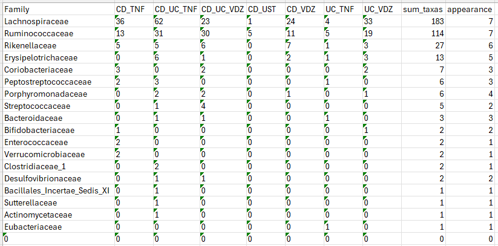

# Prediction code

The prediction routine iterates on all combinations of week (0, 14, 24) - diagnosis/cohort (CD, UC) - treatment (VDZ, UST, TNF) and outcome (Endoscopic, the most relevant one, Biomarker, and Clinical). Starting from an ISN, it predicts the outcome based on the ISN edges (code in the Edge_based_prediction folder) or by computing network statistics (i.e., Eccentricity, Centrality..) on these ISN edges (code in the Matrices_metrics folder). The two competing methods are support vector machine (SVM) and a stratified random forest (RF). The prediction, for each iteration, is evaluated via the area under the ROC curve (AUC), and the key features, namely taxa-taxa interactions, are extracted.

## Input
> Key input, for each iteration, is the ISN (outcome of the code in the ISN_construction folder), together with the relevant outcome for each individual. Each iteration is stored in a folder, containing the ISNs, and the mapping of the individuals to their external characteristics (such as the outcome).
> The Metadata, i.e., `w=_n355_metadata.txt`, contains the information mapping the individuals to their external characteristics.

## Aim
> Identify for which combination of diagnosis, treatment, and week the information contained in the edge is informative for the response to the treatment.
> For these combinations, extract the features (i.e., the edges or the network statistics calculated on the edge) that drive the predictiveness.

## Structure
For simplicity, we focus on the code for performing the prediction at baseline (week 0), via RF, and on the edges directly as features. What follows, with minor tweaks, can be applied to the other cases. Thus, we are in the `Edge_based_prediction/RFCV/Week0` folder.

> `CALLING_SCRIPT_random_forest_internal.r` launches a for-loop that iterates over all combinations of week (0, 14, 24) - diagnosis/cohort (CD, UC) - treatment (VDZ, UST, TNF) and outcome. It calls `script_computing_Random_forest_internal_v2.r` for each iteration.  
> `script_computing_Random_forest_internal_v2.r` loads the relevant files for each iteration, namely the ISN matrix, the metadata, and additional mapping of the ISNs to their external characteristics. Then, it only restricts the ISNs to the ones that have a valid outcome (i.e., not NA) and eliminates any eventual ISN edge where there is no variation among all the individuals. Finally, it couples the ISN with the outcome and calls `script_computing_Random_forest_rfcv_with_stratification.r`, which performs the RF, extracts the key features, and plots the results.  
> `script_computing_Random_forest_rfcv_with_stratification.r` performs the RF with iterative cross-validation, with 5 folds, repeated 10 times. It follows Breiman’s official documentation (https://cran.r-project.org/web/packages/randomForest/randomForest.pdf). For each of those 50 (5 times 10) runs, it calculates the model on the training with all the features, together with the features’ importance, on the out-of-the-bag observations. The variable importance was then used to build smaller models with a lower number of features (i.e., fewer ISN-edges). We tested multiple feature set sizes using a logarithmic function, choosing the one with the best AUC, averaged across folds and iterations. The variable (i.e., the edges) importance was assessed with a rank aggregation with the RankAggreg R package.

## Results
> The key results of the prediction pipeline are, for each iteration, 1) the area under the ROC curve; and 2) the ranked list of relevant features. This 2) result is then organized and combined between all the combinations (diagnosis/cohort, treatment, outcome) to extract taxa and taxa-taxa pairs that are consistently important.  
> Results are stored into the `Results/Prediction/Edge-based/w_0/RFCV` (and similarly for other weeks, SVM, or matrix metrics).

An example of the result is shown here, with the taxa that appear the most in the significant interactions at week 0 for the RF with Endoscopic outcome, grouped by their families.  

