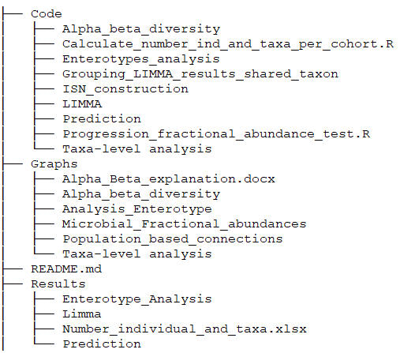

# MicrobISN_IBD
 Code, graph and results for the ISN pipeline in Microbiome IBD data

In this repository, we have collected the material, code and resulting graph for the paper "Individual specific network-based prediction of microbial interaction signatures predictive of response to small-molecule based therapies in IBD patients".

The Repository is organized as follows: 

Where the main subfolders are the different analyses we have done on this work. In each subfolder, a more detailed explanation is provided. 

If you have any more questions or comments, please contact federico.melograna@kuleuven.be

